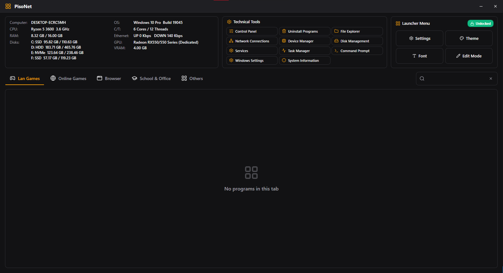

# Chromatic Menu

A fast, locked-down desktop launcher for internet cafés, gaming lounges, and coin-operated PC rentals, with an optional web dashboard that shows which PCs are on, what they are used for, and an estimate of what they earn.

<p align="center">
  
</p>

Built with C# and WPF on .NET Framework 4.8. Runs on a stock Windows 10 PC with nothing else to install, works with Faronics Deep Freeze and WinLock, and ships as a single MSI.

> **At a glance**
> - **Launcher:** tabs of games and programs, technical tools, live hardware info, admin-locked editing.
> - **Telemetry (v1.0.4, opt-in):** a background service sends a small heartbeat to *your own* Supabase project. Off until you enter a Supabase URL and key.
> - **Dashboard:** a static website (GitHub Pages) with live PC status, timelines, top programs, busy hours, revenue estimates, and customer game requests.

---

## Contents

- [Features](#features)
- [Telemetry and dashboard](#telemetry-and-dashboard)
- [Install and deploy](#install-and-deploy)
- [Upgrading from v1.0.3](#upgrading-from-v103)
- [DataTool (backup, restore, Supabase setup)](#datatool)
- [Build from source](#build-from-source)
- [Project structure](#project-structure)
- [Publishing updates](#publishing-updates)

---

## Features

### Launcher
- **Tabs of programs**: group games and apps into tabs with icons; add `.exe`, `.lnk`, `.bat`, `.cmd`, websites, and folders.
- **Drag and drop**: reorder items, move them between tabs, or drop files from Explorer to add them.
- **Broken shortcut detection**: missing targets are flagged on the card and blocked from launching with a clear message.
- **Right-click menu**: Run, Run as administrator, Open file location, Properties.
- **Search** across all tabs.

### Header panels
- **Live hardware info**: computer name, CPU, RAM, disks (SSD / HDD / NVMe), OS build, cores and threads, network up/down speed, GPU and VRAM. Refreshes every 3 seconds.
- **Technical tools**: Control Panel, Uninstall Programs, File Explorer, Network Connections, Device Manager, Disk Management, Services, Task Manager, Command Prompt, Windows Settings, System Information, and **Request a Game**.

### Admin and kiosk behavior
- **Password-protected** Settings and Edit Mode, with a forced password change on first use.
- **Session lock** toggle with a visible Locked / Unlocked indicator.
- **Kiosk windowing**: borderless and maximized, respects the taskbar; the X button and Alt+F4 only minimize.

### Deep Freeze awareness and updates
- Detects Deep Freeze and whether the PC is **Boot Frozen** or **Thawed**.
- **Check for Updates** (Settings › About) downloads the latest MSI from GitHub Releases and installs it, but only when the PC is Thawed, so an update is never lost on reboot.

### Appearance
- Flat dark and light themes, accent colors, custom colors, fonts with 0.8x to 1.4x scaling, and a custom wallpaper.

### Backup and portability
- Config in `data\config.json`, saved atomically with a `.bak` copy.
- **Export / Import** a ZIP of the config and assets to copy a setup to other PCs.

---

## Telemetry and dashboard

### How it works

```
Launcher ──(named pipe: program name)──▶ ChromaticTelemetry service ──(HTTPS, insert only)──▶ Supabase: heartbeats
Launcher ──(HTTPS, insert only: Request a Game)────────────────────────────────────────────▶ Supabase: game_requests
Dashboard in a browser (signed-in user) ──(read)──▶ Supabase
```

- **ChromaticTelemetry** is a Windows service (LocalSystem, starts with Windows, no UI) installed by the MSI.
- Every interval (default **60 s**, adjustable 30 to 600 s) it inserts one heartbeat row into your Supabase project.
- If the internet is down, rows wait **in memory only** (never on disk, max 720) and are sent together, oldest first, when it's back.

### When is data sent?

Chromatic Menu has **no built-in Supabase project**. Out of the box the launcher works normally and nothing is sent.

| Heartbeats are sent when **all three** are true | Where to set it |
| :--- | :--- |
| 1. **Start with Windows** is on | Settings › General |
| 2. **Enable telemetry** is on (default) | Settings › Telemetry |
| 3. A **Supabase URL and anon key** are set | Settings › Telemetry, or [DataTool](#datatool) option **[2]** |

The **Request a Game** button appears when telemetry is on and a URL and key are set. Changes apply within seconds: no restart and no admin rights are needed.

### What is sent, and what is not

| Sent | Never sent |
| :--- | :--- |
| Time, PC name, shop name, heartbeat interval | Window titles, file paths |
| Name of the program in the foreground (e.g. `Google Chrome`). Built-in Windows apps are reported as `Windows`; the launcher and desktop as `Chromatic Menu` | Windows usernames, IP or MAC addresses, hardware IDs |
| Game requests: title and description typed by the customer | Anything while telemetry is off or not configured |

Only the **anon / public** key is ever used. Supabase Row Level Security lets it **add** rows but never **read** them. Only dashboard users you create can read data.

### The dashboard

A static site in [`docs/`](docs/) with:

| Page | What it answers |
| :--- | :--- |
| **Overview** | Which PCs are online right now, what they are running, today's estimated revenue and utilisation, and anything that needs attention |
| **Timeline** | When each PC was on, active, or idle during a day, with power-ons and longest session |
| **Programs** | The most used programs, overall and per PC |
| **Revenue** | Estimated revenue per day and per PC, change vs the previous period, best day, busy-hours heatmap |
| **Game requests** | What customers asked for, marked New, Added, or Rejected |
| **Settings** | Currency, revenue rate, theme, connection |

**Revenue estimate:** active minutes (a program other than Chromatic Menu in the foreground) ÷ the rate. The default rate is **1 unit of currency per 9 minutes**; the currency and rate are set in the dashboard's Settings. The coin timer only turns off the monitor, so a game left open after time runs out still counts.

### Set up Supabase and the dashboard

1. Follow the setup guide, [`docs/setup.html`](docs/setup.html) (also on the deployed site):
   - create a free Supabase project
   - run [`docs/supabase/schema.sql`](docs/supabase/schema.sql) in the SQL Editor
   - turn off public sign-ups
   - create your dashboard login
2. **Deploy the dashboard:** in the GitHub repository, open **Settings › Pages**, choose **Deploy from a branch**, branch `main`, folder `/docs`.
3. **Point each PC** at the project, with [DataTool](#datatool) option **[2]** or in Settings › Telemetry.
4. **Open the site**, enter the same URL and anon key, and sign in. You stay signed in on that browser until you log out.

---

## Install and deploy

### Setup wizard
Double-click `ChromaticMenu-Setup.msi`:
- Installs to `C:\Program Files\Chromatic Menu\`, with Desktop and Start Menu shortcuts.
- Makes `data\`, `data\assets\`, and `data\logs\` writable for standard users.
- Installs and starts the **ChromaticTelemetry** service. It sends nothing until it's configured.

### Silent install
```cmd
msiexec.exe /i "ChromaticMenu-Setup.msi" /qn
```

### Uninstall

| Method | Removes the program and service | Removes `data` (programs, tabs, icons) |
| :--- | :---: | :---: |
| Start Menu › **Uninstall Chromatic Menu**, or `Uninstall.exe` | Yes | **Yes** |
| Windows Settings › Installed Apps | Yes | No, it is kept |

Since v1.0.4 the installer itself never deletes `data`, so updates always keep the shop's configuration.

Full technician guide: [`documentation/DEPLOYMENT.md`](documentation/DEPLOYMENT.md).

---

## Upgrading from v1.0.3

> **Important:** the v1.0.3 installer deletes the `data` folder when it's removed, and an update removes it. This applies once, to any PC still on **1.0.3 or older**, whichever newer version you install. From 1.0.4 on, updates keep the data by themselves.

On each PC, booted **Thawed**:

1. Run `tools\ChromaticMenu-DataTool.bat` and choose **[0] Backup**.
2. Update with **Settings › About › Check for Updates**.
3. Run the tool again: **[1] Restore**, then **[2] Set up Supabase**.
4. Check your programs are back, then refreeze the PC.

---

## DataTool

`tools\ChromaticMenu-DataTool.bat` is a standalone script for technicians. It asks for admin rights itself and warns if Deep Freeze looks Frozen.

| Option | What it does |
| :--- | :--- |
| **[0] Backup** | Copies `data` to `C:\ChromaticMenu-Backup\latest` and keeps the previous backup. It refuses to overwrite a backup that has more programs than the current data, which protects you after an accidental wipe. |
| **[1] Restore** | Force-closes the launcher, saves the current data to `pre-restore`, restores the backup, and checks the program count. |
| **[2] Set up Supabase** | Writes a Supabase URL and anon key into the `telemetry` part of `config.json` (nothing else changes), turns telemetry on, and restarts the service. Press Enter to use the defaults at the top of the .bat. Needs v1.0.4 or newer. |
| **[3] Open backup folder** | Opens `C:\ChromaticMenu-Backup`. |

To preset your own project, edit `DEFAULT_SUPABASE_URL` and `DEFAULT_SUPABASE_KEY` at the top of the .bat. Use only the anon / public key.

---

## Build from source

### Prerequisites
- Windows 10 or 11
- [.NET SDK](https://dotnet.microsoft.com/download) 6.0 or newer (for building)
- [.NET Framework 4.8 Developer Pack](https://dotnet.microsoft.com/download/dotnet-framework/net48)
- WiX Toolset v4: `dotnet tool install --global wix --version 4.0.6`

### Build the launcher and service
```powershell
dotnet build -c Release "Chromatic Menu.sln"
```
Outputs:
- `src\Chromatic Menu\bin\Release\net48\Chromatic Menu.exe`
- `src\ChromaticTelemetry\bin\Release\net48\ChromaticTelemetry.exe`

### Build the MSI
```powershell
.\build-msi.ps1                    # version from the csproj
.\build-msi.ps1 -Version "1.0.5"   # or a specific version
```
The script builds the launcher and the service with the version stamped in, compiles `Uninstall.exe`, and writes `bin\Release\ChromaticMenu-Setup.msi`.

### Preview the dashboard locally
```powershell
python -m http.server 8765 --directory docs
```
Then open `http://localhost:8765`. The site uses ES modules, so opening `index.html` as a file doesn't work.

---

## Project structure

```
Chromatic Menu/
├── src/
│   ├── Chromatic Menu/          # WPF launcher (MVVM: Views, ViewModels, Models, Services, Native)
│   ├── ChromaticTelemetry/      # Windows service: heartbeats, in-memory buffer, named pipe server
│   └── Shared/                  # Code linked into both: telemetry settings, Supabase client, logger
├── installer/                   # WiX v4 MSI definition, uninstall helper, license
├── docs/                        # Dashboard website (GitHub Pages)
│   ├── index.html, setup.html
│   ├── assets/                  # CSS and JavaScript
│   └── supabase/schema.sql      # Database schema, security rules, dashboard functions
├── documentation/               # DEPLOYMENT.md, TELEMETRY-SPEC.md
├── tools/                       # DataTool, icon converter, password hash helper
├── build-msi.ps1
└── SPEC.md                      # Engineering and design rules
```

| Component | Technology |
| :--- | :--- |
| Launcher | .NET Framework 4.8, WPF, MVVM (own `ObservableObject` / `RelayCommand`) |
| Service | .NET Framework 4.8 Windows service, `HttpClient`, named pipes |
| Packaging | Costura.Fody (single-file exe), WiX Toolset v4 |
| Backend | Supabase (Postgres, Row Level Security, pg_cron) |
| Dashboard | Static HTML, CSS and JavaScript, supabase-js, Chart.js |

---

## Publishing updates

1. Build: `.\build-msi.ps1 -Version "1.0.5"`
2. Create a GitHub Release tagged `v1.0.5` and attach `bin\Release\ChromaticMenu-Setup.msi`.
3. On each PC, boot Thawed and use **Settings › About › Check for Updates**.

> Keep the installer's component GUIDs and `MajorUpgrade Schedule="afterInstallExecute"` unchanged in future versions. They are what keep data safe during upgrades.

---

## License

Created and maintained by [HanazonoArchive](https://github.com/HanazonoArchive). Distributed under the MIT License. Free for personal, commercial, and organizational use.
